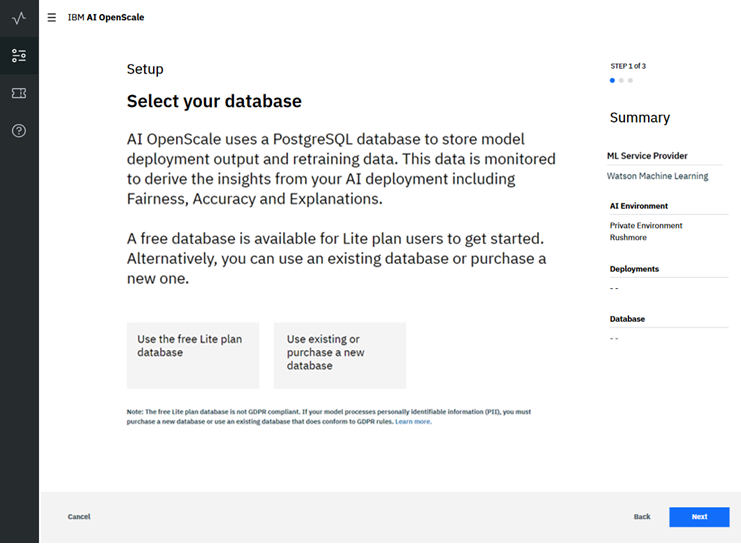
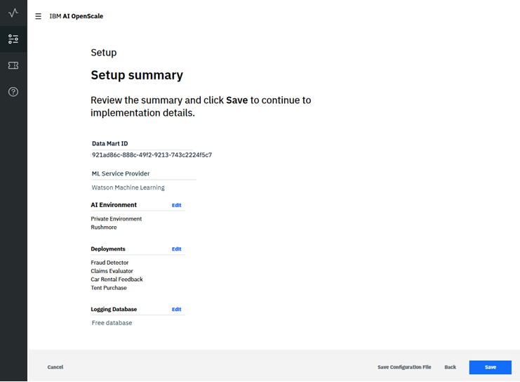
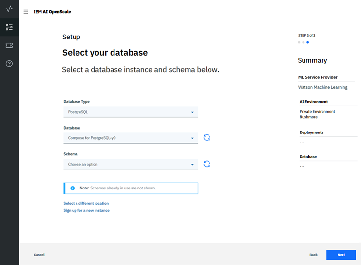

---

copyright:
  years: 2018
lastupdated: "2018-11-13"

---

{:shortdesc: .shortdesc}
{:new_window: target="_blank"}
{:tip: .tip}
{:pre: .pre}
{:codeblock: .codeblock}
{:screen: .screen}

# Specify your database
{: #connect-db}

Specify a database for your {{site.data.keyword.aios_short}} instance to use.
{: shortdesc}

## Connecting to your database
{: #connect-config-db}

{{site.data.keyword.aios_short}} uses a database to store payload, feedback, and measurement data. Besides selecting a database, you may also able to select a schema for your database - a schema is a named collection of tables in the database.

**Note**: For the current release, only a PostgreSQL database is supported. The PostgreSQL database needs to be in the same {{site.data.keyword.Bluemix_notm}} account where the {{site.data.keyword.aios_short}} instance is located.

1.  Choose a PostgreSQL database. You have two options: the free Lite plan database, or an existing or new database.

    

### Free Lite plan database

**NOTE**: The free Lite plan database has some important limitations:

- The free Lite plan database is hosted, and is not directly accessible to you.
- {{site.data.keyword.aios_full}} will have full access to your database, and thus will have full access to your data.
- The free Lite plan database is not GDPR-compliant. If your model processes personally-identifiable information (PII), you cannot use the free Lite plan database. You must purchase a new database, or use an existing database that conforms to GDPR rules. See [Information security](information-security.html) to learn more.

To proceed with using the free Lite plan database, simply select that option, then review the summary data and click **Save**.

  

### Existing or new database

Once you have selected the "Use existing or purchase new database" option, {{site.data.keyword.aios_short}} checks your {{site.data.keyword.Bluemix_notm}} account to locate any existing databases.

**Note**: For the current release, only a PostgreSQL database is supported.

You can select a database from the **Database** drop-down menu, and then a **Schema**:

  

  You can also select the **Sign up for a new instance** link to purchase a new Postgres instance in {{site.data.keyword.Bluemix_notm}}.

Once you have selected a database and schema, click **Next** to review the summary data and click **Save**.

### Next steps
{: #connect-next}

{{site.data.keyword.aios_short}} is now ready for you to [configure monitors for your deployments](monitor-overview.html).
