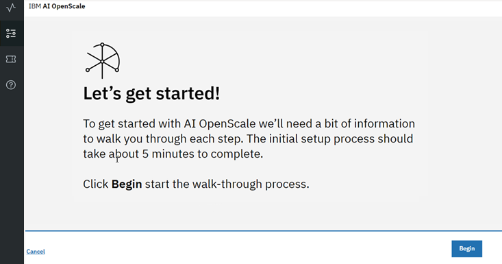

---

copyright:
  years: 2015, 2018
lastupdated: "2018-11-13"

---

{:shortdesc: .shortdesc}
{:new_window: target="_blank"}
{:tip: .tip}
{:pre: .pre}
{:codeblock: .codeblock}
{:screen: .screen}

# Specify your Watson Machine Learning service instance
{: #connect-wml}

Your first step in the {{site.data.keyword.aios_short}} tool is to specify  a Watson Machine Learning (WML) instance. Your WML instance is where you store your AI models and deployments.
{: shortdesc}

## Prerequisites
{: #connect-prereq}

You should have provisioned a WML instance in the same {{site.data.keyword.Bluemix_notm}} account where the {{site.data.keyword.aios_short}} service instance is present. If you have provisioned a WML instance in some other account, then you will not be able to configure that instance with {{site.data.keyword.aios_short}}.

## Connect your Watson Machine Learning service instance
{: #connect-config-wml}

{{site.data.keyword.aios_short}} connects to AI models and deployments in a WML instance.

1.  From the home page of the {{site.data.keyword.aios_short}} tool, click **Begin**.

    

1.  {{site.data.keyword.aios_short}} checks your {{site.data.keyword.Bluemix_notm}} account to locate any existing WML instances. You can then select an instance from the **Watson Machine Learning service** drop-down menu.

    

    You can also select the **Add new connection** link to purchase a new WML service instance, and select a plan, in {{site.data.keyword.Bluemix_notm}}. Once you have done that, refresh this page so that the newly-provisioned WML instance is displayed for selection.

1.  Click **Next**.

### Next steps
{: #connect-next}

{{site.data.keyword.aios_short}} is now ready for you to [select which deployments](connect-deploy.html) you want to monitor.
