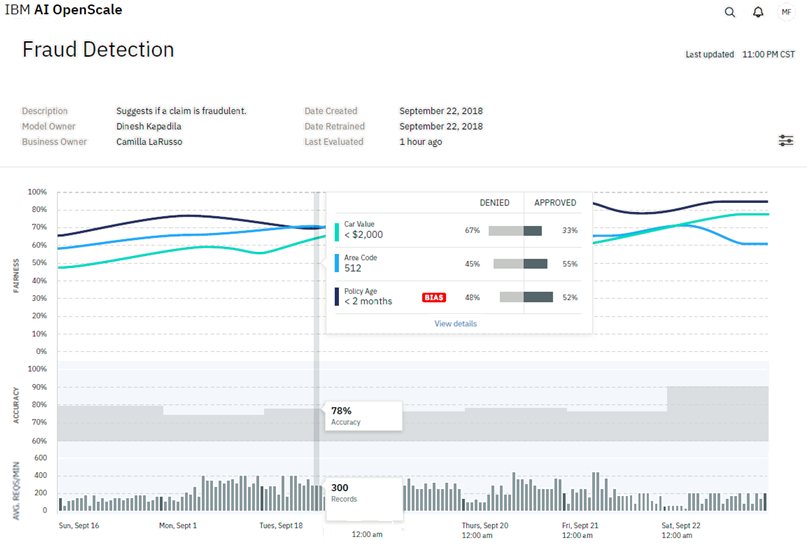
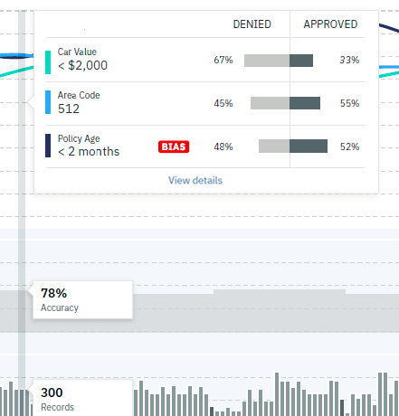
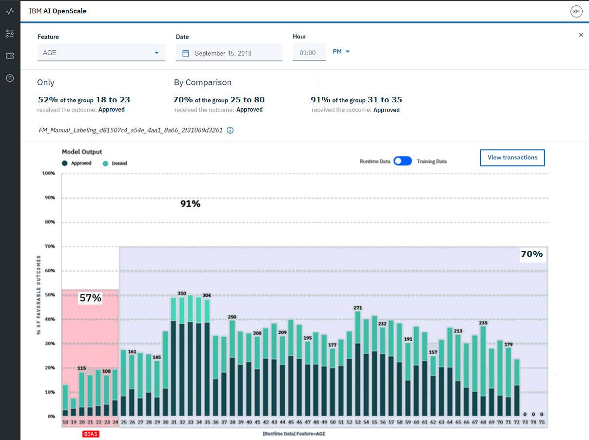
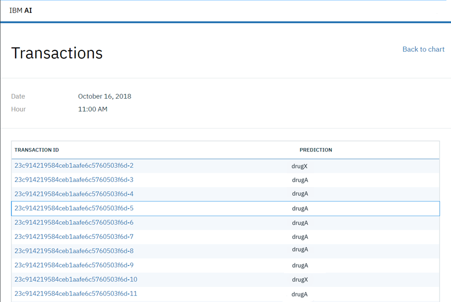

---

copyright:
  years: 2018
lastupdated: "2018-11-28"

---

{:shortdesc: .shortdesc}
{:new_window: target="_blank"}
{:tip: .tip}
{:pre: .pre}
{:codeblock: .codeblock}
{:screen: .screen}

# Working with monitored data
{: #insight-deploy-detail}

Select a deployment from the dashboard to see monitoring data for that deployment.
{: shortdesc}

## Monitoring Fairness, Average Requests per Minute, and Accuracy
{: #insight-time-chart}

Monitoring data for individual deployments are displayed in a time series chart. The chart tracks Fairness, Average Requests per Minute, and Accuracy over the last seven days.

  

Move the marker across the chart to see statistics for an individual hour. In this example, the time selected is 1:00 PM CST on September 18, which reveals the following statistics:

  

- ***Fairness***: Two of three Fairness features, Car Value and Area Code, met their set thresholds for approval. The third Fairness feature, Policy Age, was flagged for bias. You can also see the number of expected outcomes (in this case percentages Approved vs. Denied) for an individual population in the features monitored for fairness.
- ***Accuracy***: The Accuracy metric averaged 78%.
- ***Avg. Reqs/Min***: On average, 300 records were processed per minute between 1:00 and 2:00 PM CST. The throughput is computed every minute, and its average value over the course of the hour is reported in the chart.

Select the chart to see details behind a particular Fairness statistic.

### Data visualization
{: #insight-data-visual}

Clicking the chart opens a visualization of the data points for a monitored feature at a specific hour. Following the previous example, the Policy Age feature, which has been tagged for bias, is shown.

  

Note the three filters at the top of the page (Feature, Date, and Hour) that let you select a different feature or time to review details. This chart is showing multiple things:

- You can observe the population experiencing bias (policies that are less than 2 months old). The chart also shows the percentage of expected outcome (50%) for this population.

- The chart shows the percentage of expected outcome (90%) for the reference population. This is the average of expected outcome across all reference populations.

- The chart is indicating the presence of bias, because the ratio of percentage of expected outcomes for populations with policies less than 2 months old to the percentage of expected outcomes for the reference population is below the threshold. In other words, 0.5/0.9 = 0.55, which is less than the 0.8 threshold.

- The chart also shows the distribution of the reference and mmoitored values for each distinct value of the attribute in the data from the payload table which was analyzed to identify bias. In other words, if the bias detection algorithm analyzed the last 1790 records from the payload table, then 120 of those records had policy age less than 2 months, and out of that distribution the `Not fraud` and `Fraud` outcomes are represented by the bar chart. The distribution of the payload data is shown for each distinct value of the fairness attribute (even reference values are shown). This information can be used to correlate the bias with the amount of data received by the model.

- The chart additionally shows that the population with a policy age between 5-10 years received 100% expected outcomes. This signifies the source of the bias, which means that data in this group skewed the results, and led to an increase in the percentage of expected outcomes for the reference class. This information can be used to identify parts of the data which can then be under-sampled when retraining the model.

- Another important thing that the chart shows is the name of the table containing the data which has been identified for manual labelling. Whenever the algorithm detects bias in a model, it also identifies the data points which can be sent for manual labelling by humans. This manually-labelled data can then be used along with the original training data to retrain the model. This retrained model is likely to not have the bias. The manual labelling table is present in the PostgreSQL database associated with the {{site.data.keyword.aios_short}} instance.

- *Runtime and Training Data*

  The Runtime data / Training data switch lets you toggle the differences between your trained model and the data collected at runtime that is triggering a bias warning.

  

- *View Transactions*

  This option allows you to view the individual transactions that contributed to bias. When you click this link:

  

  a list of transactions for the past hour is listed.

  

  Copy and paste any of the transaction IDs into the Explainability tab to get details about that transaction. See [Monitoring Explainability](insight-timechart.html#insight-explain) below.

## Monitoring Explainability
{: #insight-explain}

For each deployment, you can see explainability data for specific transactions by selecting the Transactions tab (  ) in the navigator.

You will first be prompted to enter a Transaction ID. Whenever data is sent to the model for scoring, it sets a transaction ID in the HTTP header by setting the `X-Global-Transaction-Id` field. This transaction ID gets stored in the payload table. If you want to find an explanation of the model behavior for a particular scoring, then it can be done by specifying the transaction id associated with that scoring request. See the tutorial for information about [finding and using a transaction ID](https://console.bluemix.net/docs/services/ai-openscale/tutorial.html#view-the-explainability-for-a-model-transaction).

  

In this example of a binary classification model, you can see the confidence in the model prediction (90%). You can also see the factors that contributed positively to the final outcome (FRAUD), and those that contribute negatively to the final outcome (FRAUD). The feature *Responsible Party* having a value of `Self` had the maximum impact in the model deciding a FRAUD outcome. The other two features that contributed to the outcome were *Police report* and *Claim amount*. The feature *Car Brand=BMW* and *Car Year=2007* had a negative impact on the model predicting that it was a FRAUD. In other words, if the value of *Car Brand* was not `BMW` then the model would have had more confidence (more than 90%) in the fact that the transaction was FRAUD.

  

For an image classification model example, you can see which parts of an image contributed positively to the predicted outcome and which contributed negatively. In the below example, the image on the right show the parts which impacted positively to the prediction and the image on the left shows the parts of images that had a negative impact on the outcome.

**Note**: Currently, explanations cannot be generated for images which are greater than 1 MB in size.

  

Finally, an example of a classification model that evaluates unstructured text. The explanation shows the keywords that had a positive as well as a negative impact on the model prediction. We also show the position of the identified keywords in the original text which was fed as input to the model.

  
